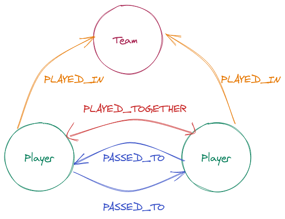
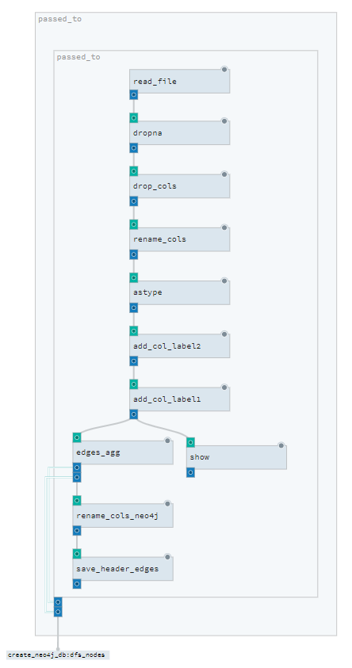
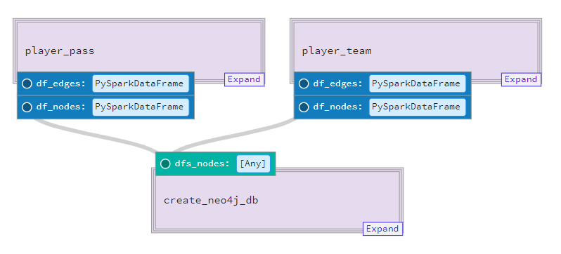
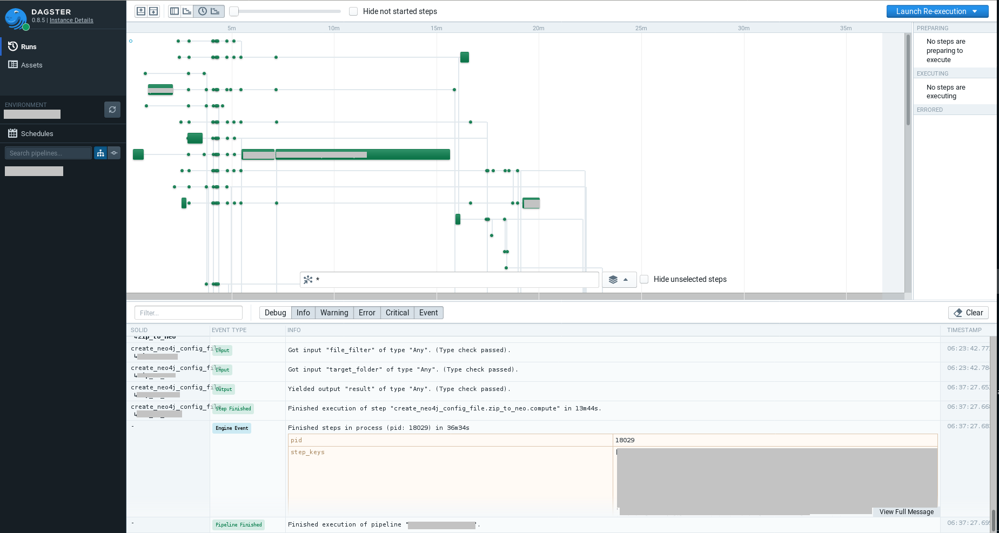
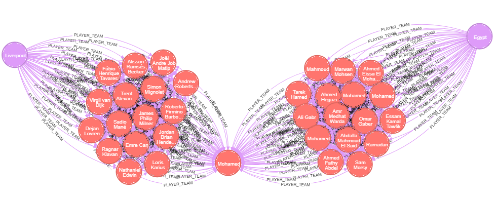

This repo is an example of using [dagster framework](https://docs.dagster.io/) for a real world data pipeline.


# Implementing a graph network pipeline with Dagster

## Background
* Working in the Intelligence arena we try to 'connect the dots' to extract meaningful information from data.
* We analyze various datasets to link between them in a logical manner.
* This is useful in many different projects - so we needed to build a pipeline that can be both dynamic and robust, and be readily and easily  utilized.
* In this blog post we share our experience in running one of our data pipelines with  [dagster](https://docs.dagster.io/) - which uses a modern approach (compared to the traditional Airflow / Luigi task managers), see [Dagster's website description](https://docs.dagster.io/docs/learn)
* We hope this blog post will help others to adopt such a data-pipeline and allow them to learn from our experiences.

## Our Challenge

#### Connecting the dots
* Finding relationships between different entities can be challenging (especially across datasets) - but is vital when building a reliable intelligent report.
* A logical structure to store the entities and their relationships is in a [Graph Database](https://en.wikipedia.org/wiki/Graph_database). In this example we are going to use [Neo4j](https://neo4j.com/) DB for storing the graph.
* Also we are going to use _psedo BigData_. However the pipeline that we are presenting generates billions of relationships.
* The outcome files of the pipeline will be in the format that will allow to use the dedicated [Neo4j tool for bulk import](https://neo4j.com/docs/operations-manual/4.1/tools/import/).   In the future we will do a separate blog post on our data analysis workflow with `Neo4j`.

#### First take
* Our initial version for our pipeline was based on custom code and configurations (YAML) files.
*  The code base is a combination of R and Python script that utilize Spark, Dask and HDFS.
*  A shell script aggregated all the scripts to run the entire workflow

#### Inspect and Adapt
After our initial alpha version we noticed that we had some problems that required our attention:
* The pipeline was built horizontally (per process) and not vertically (per dataset) - leading to uncertainty and fragmented results
* We needed to refactor our code in order to stabilize and verify the quality of the product.
* Working with [dask](www.dask.org) didn't solve all of our use-cases and so we needed to run some workloads on [spark](https://spark.apache.org/).

After checking several options we chose `dagster` as our pipeline framework for numerous reasons - including:
1. Simplicity logic/framework
2. Modern architecture with data as a "first class citizen".
3. Open-source code base
4. The framework includes a modern UI for monitoring and communicating the workflow status
5. Pipeline supports data dependencies (and not function outputs)
6. Ability to log/monitor metrics

It was fortunate that our configuration files allowed us to identify the various functions and abstract our business logic from the data transformation.

*** This is a `dagster` _intermediate level_ blog post - for newbees it is recommended to run through the [beginner tutorial](https://docs.dagster.io/docs/tutorial) on the dagster's site.


## Understanding `Dagster` __lego__ blocks

Before we start, here's a short introduction to Dagster's *_lego_* building blocks [see dagster documentation](https://docs.dagster.io/docs/learn/concepts):

* At the core we have `solids` - these are the various "functional unit of computation that consumes and produces data assets".
* The `solids` can be aggregated into `composite solids`.
* A `solid` can have __inputs__ and __outputs__ that can be passed along the pipeline.
* A `pipeline` orchestrates the various `solids` and the data flows.

#### Design implementation
The following diagram displays the architecture  outline of the code:


* YAML configurations
  `Dagster` has many configuration files that assist in managing pipelines and there environments. In this example we will use only 2 configuration types:
    * resources - configuration file that manges the resources for the running pipeline
    * solids - configuration file for the `composite solids`. Each data source has its own configuration, in addition to the composite solid that implements the creation of the Neo4j DB.

* Inputs
    * Our premise is that the datasets inputs arrive in a timely manner (batch not streaming).
    * Each dataset source has a corresponding configuration file.

* Pipeline
    * The `pipeline` consists of all the `composite solids` that organize the work that needs to be executed within each `solid`.

* Output Files
    * In our example the outputs are:
        * Nodes and Edges flat files in the format to be bulk imported into Neo4j
        * Neo4j DB


### Let's build

Now we will build our basic units needed for our project:
Since we have several datasets we will can build each building block to be executed with a configuration file.
1. Read file into dataframe  (e.g. `cvs` and `parquet`)
2. Message our data to fit the schema that we want for our graph network (including: adding/drop columns,  rename_columns, concat columns etc.)
3. Generate nodes and edges  (per entity in the graph model)
4. Save nodes and edges into csv files

Finally we will bulk import the csv files (nodes and edges) into `Neo4j`

## Data

In order to demonstrate our workflow we will use data from [](https://statsbomb.com/), a football analytics company that provides data from various leagues and competitions (for those American readers - we talking about the __original__ football - *_soccer_* ) . The company has a free open data API tier that can be accessed using the instructions on [their git hub page](https://github.com/statsbomb/statsbombpy#open-data).

We would like to find the relationships between the players in the following dimensions:
1. Player relationship
    1. Played together in the same match
    2. Passed the ball to
2. Team relationship - Player played in in a team

We will be building a graph based on the following entity model:




The following script is available to download the data into 2 separate datasets:
1. Player lineup as csv  [link to notebook](notebooks/statsbomb_player_team.ipynb)
2. Player pass as parquet  [link to notebook](notebooks/statsbomb_player_pass.ipynb)


### Understanding the datasets

#### Player Lineup

This dataset has all the information regarding the players relationships with their teams. The key columns that we will use are:
1. `player_id` -  identifies each `Player`
2. `team_id` -  identifies each `Team`
2. `team_id` & `match_id` - will create our `EdgeID` to identify when a `Player` `PLAYED_TOGETHER` with another `Player`
3.  The `Player` `PLAYED_IN` relationship can be immediately derived from the table.

#### Player Pass
This dataset has all the information regarding the players action within a match. The key columns that we will use are:
1. `player_id` - identifies each `Player`
2. `pass_type` - identifies the event in the match (we will select only the `pass` event)
2. `pass_recipient` - will identify the recipient of the pass


Additional properties will enrich the Nodes and Edges.


### Let's  play  Lego

Let's see how we can use the `dagster`'s  blocks

Since we are working with _BigData_ we will be working with `spark` (we also implemented some of workflow on `Dask` - but will keep this for a future post).
We will need to tell `dagster` what resources we are going to use. In dagster's environment everything is very module so we can define our resource with a YAML file [see api resource documentation](https://docs.dagster.io/docs/apidocs/pipeline#dagster.resource).

In our env_yaml folder we have the following `env_yaml/resources.yaml` file:

```
resources:
    spark:
      config:
        spark_conf:
          spark:
            master: "local"
```

Additional configuration for `spark` can  be included under `spark_conf`. For our workload we added for example the following parameters:

> spark.executor.memoryOverhead: "16G"
> spark.driver.memory: "8G"

Obviously for the example in this post there is no need to add any additional parameters.

### Solid Intro

Lets review a simple `solid`  such as a `show` function for a spark dataframe:

```
@solid(
    config_schema={
        "num_rows": Field(
            Int, is_required=False, default_value=5, description=("Number of rows to display"),
        ),
    }
)
def show(context, df: DataFrame):
    num_rows = context.solid_config.get("num_rows")
    context.log.info(f"df.show():\n{df._jdf.showString(num_rows, 20, False)}")

```

The `@solid()` decorator above the function converts the function into a `solid` so dagster can utilize/ingest it.
The [solid decorator](https://docs.dagster.io/docs/apidocs/solids)  can take several parameters. In this `solid` we are just using
* [config_schema]("https://docs.dagster.io/docs/apidocs/config#dagster.ConfigSchema") which consists of:
    * [Field]("https://docs.dagster.io/docs/apidocs/config#dagster.Field") "num_rows" which will determine the number of rows to print out with the following properties:
        * `Int` type (see list of available [types](https://docs.dagster.io/docs/apidocs/types)) .
        * `is_required` (boolean) determines if this parameter is is_required
        * `default_value` for the number of rows to show
        * `description` of the Field parameter.

The config_schema assists in checking the validity of our pipeline.

> def show(context, df: DataFrame):

Our function receives the [context]("https://docs.dagster.io/docs/apidocs/execution#dagster.Context") of the solid (supplementing the function with some additional inputs), in addition to a parameter that it will receive from the pipeline (which is a DataFrame).
> num_rows = context.solid_config.get("num_rows")

When the function is executed we get the `num_rows` parameter
> context.log.info(f"df.show():\n{df._jdf.showString(num_rows, 20, False)}")

Then we are using the [internal dagster logging]("https://docs.dagster.io/docs/apidocs/internals#dagster.DagsterLogManager") to print out the number of rows of the Dataframe.


### Solid  Cont.
Now lets delve deeper into a more complex `solid` such as `read_file` :

```
@solid(
    output_defs=[OutputDefinition(dagster_type=DataFrame, name="df")],
    required_resource_keys={"spark"},
    config_schema={
        "path": Field(
            Any,
            is_required=True,
            description=(
                "String or a list of string for file-system backed data sources."
            ),
        ),
        "dtype": Field(
            list,
            is_required=False,
            description='Dictionary with column types e.g. {"col_name": "string"}.',
        ),
        "format": Field(
            String,
            default_value="csv",
            is_required=False,
            description='String for format of the data source. Default to "parquet".',
        ),
        "options": Field(
            Permissive(
                fields={
                    "inferSchema": Field(Bool, is_required=False),
                    "sep": Field(String, is_required=False),
                    "header": Field(Bool, is_required=False),
                    "encoding": Field(String, is_required=False),
                }
            ),
            is_required=False,
        ),
    },
)
def read_file(context) -> DataFrame:
    path = context.solid_config["path"]
    dtype = context.solid_config.get("dtype")
    _format = context.solid_config.get("format")
    options = context.solid_config.get("options", {})
    context.log.debug(
        f"read_file: path={path}, dtype={dtype}, _format={_format}, options={options}, "
    )
    spark = context.resources.spark.spark_session
    if dtype:
        df = (
            spark.read.format(_format)
            .options(**options)
            .schema(transform.create_schema(dtype))
            .load(path)
        )
    else:
        df = spark.read.format(_format).options(**options).load(path)

    yield Output(df, "df")


```

Lets now break it down


#### `solid` decorator
In this [`solid` decorator](https://docs.dagster.io/docs/apidocs/solids#dagster.SolidDefinition) we have some additional parameters:
> output_defs=\[OutputDefinition(dagster_type=DataFrame, name="df")\],

* output_defs defines a list of [OutputDefinition](https://docs.dagster.io/docs/apidocs/solids#dagster.OutputDefinition) of the `solid`.  In our case the output will be a `dataframe` that will be consumed by `solid`s in the pipeline.  The `name` of the object in the OutputDefinition can be consumed by other `solid`s.

> required_resource_keys={"spark"}

* The [resources](https://docs.dagster.io/docs/apidocs/solids#dagster.SolidDefinition) that the solid requires in order to execute.

```
 config_schema={
         "path": Field(
        ...
        "options": Field(
            Permissive(
                fields={
                    "inferSchema": Field(Bool, is_required=False),
                    "sep": Field(String, is_required=False),
                    "header": Field(Bool, is_required=False),
                    "encoding": Field(String, is_required=False),
                }
            ),
            is_required=False,
        ),

```
* [config_schema](("https://docs.dagster.io/docs/apidocs/config#dagster.ConfigSchema")) - similar to the explanation above.
    * In this `solid` we also have a `Permissive` Field type as a dictionary that will take various option parameters for reading in file.


#### solid in actions
Now let's look what the `solid` does.

> def read_file(context) -> DataFrame:

Every solid has a `context` which is a collection of information provided by the system, such as the parameters provided within the `config_schema`.  In this solid there is no additional parameter (compared to the above `show solid` since this is the starting point of the pipeline)


>    path = context.solid_config.get("path")
>    dtype = context.solid_config.get("dtype")
>    _format = context.solid_config.get("format")
>    options = context.solid_config.get("options", {})

In order to obtain the values from the `context` we can use the `solid_config` method

>    context.log.debug(f"read_file: path={path}, dtype={dtype}, _format={_format}, options={options}, ")

Dagster comes with a [build in logger](https://docs.dagster.io/docs/apidocs/pipeline#dagster.logger) that tracks all the events in the pipeline. In addition you are able to add any logs that you require.

>  spark = context.resources.spark.spark_session

Normally we would get the `spark_session` from the importing [pyspark.sql.SparkSession](http://spark.apache.org/docs/latest/api/python/pyspark.sql.html#pyspark.sql.SparkSession), however since we already configured our `resources` - we will get our session from the `context.resources`.

 ```
    if dtype:
        df = (
            spark.read.format(_format)
            .options(**options)
            .schema(transform.create_schema(dtype))
            .load(path)
        )
    else:
        df = spark.read.format(_format).options(**options).load(path)
```
Now that we have everything in place we can run the basic code to read in the data into spark.

>    yield Output(df, "df")

Finally the function yields an [Output](https://docs.dagster.io/docs/apidocs/solids#dagster.Output) that can be consumed by the other solids in the pipeline.

### Composite Solids
A single `solid` executes a
computation, however when wanting to create dependencies between solids we can use a [composite_solid](https://docs.dagster.io/docs/apidocs/solids#dagster.composite_solid).

Here is a screen shot of the `composite_solid` from [dagit](https://docs.dagster.io/tutorial/execute#executing-our-first-pipeline)


Lets review the `passed_to` composite_solid

```
@composite_solid(
    output_defs=(
        [
            OutputDefinition(name="df_edges", dagster_type=DataFrame),
            OutputDefinition(name="df_nodes", dagster_type=DataFrame),
        ]
    ),
)
def passed_to():
    df_edges_disc = solids_transform.lit.alias("add_col_label1")(
        solids_transform.lit.alias("add_col_label2")(
            solids_transform.rename_cols(
                solids_transform.drop_cols(
                    solids_transform.dropna(solids_fcutils.read_file())
                )
            )
        )
    )

    df_edges, df_nodes = solids_edges.edges_agg(df_edges_disc)
    solids_fcutils.save_header.alias("save_header_edges")(df_edges)
    return df_edges, df_nodes
```
* The [@composite_solid](https://docs.dagster.io/docs/apidocs/solids#dagster.composite_solid) is very similar to the [@solid](https://docs.dagster.io/docs/apidocs/solids#dagster.SolidDefinition) decorator.

* Here we can see how the solids are nested within each other.  Every `solid` has an input of a `DataFrame` (excpet for the `read_file` solid).  An every solid has an `Output` `DataFrame`.
* The `alias` allows to call the same `solid` several time within a single [composite_solid](https://docs.dagster.io/docs/apidocs/solids#dagster.composite_solid).
* A solid can return several outputs (which need to be defined in the solid decorator under the `OutputDefinition` parameter )


### Pipeline

Finally we can put everything together in our pipeline. A [pipeline](https://docs.dagster.io/docs/apidocs/pipeline#dagster.pipeline) builds up a dependency graph between the solids/composite_solids.



```
@pipeline(mode_defs=[ModeDefinition(resource_defs={"spark": pyspark_resource})])
def statsbomb_pipeline():
    passed_to_edges, passed_to_nodes = passed_to()
    played_together_edges, played_together_nodes = played_together()
    played_in_edges, played_in_nodes = played_in()
    create_neo4j_db(dfs_nodes=[passed_to_nodes, played_together_nodes, played_in_nodes])
```
In our pipeline, we have three `composite_solid`s that output 2 `Dataframe` objects.
Our final `create_neo4j_db composite_solid` is dependent on the output of the prior 2 `composite_solid`s and executes a solid to generate the node files, in addition to execute a `neo4j-admin.bat` script to bulk import that data into the database.  
 

### Dagit  
The DAG output of the run can be viewed with [Dagit](https://docs.dagster.io/tutorial/execute#executing-our-first-pipeline) (`dagster's` UI).  This allows to review the various steps in the pipeline and get additional information on the various solids tasks.  
Bellow is an image from one of our pipelines  

 

## Into Neo4j

The results of the Pipeline can be imported into `neo4j` .  
In order to import _bigData_ in an optimal manner we will use the [batch import](https://neo4j.com/docs/operations-manual/4.1/tools/import/) admin tool.  This allows for loading tens of millions of nodes and billions of relationships  in the matter of hours.  

The result of the _import_ command is a `Neo4j` database that can be loaded from [data/processed/](data/processed/stats_player.db.zip).  To load the database you can use [neo4j-admin load](https://neo4j.com/docs/operations-manual/3.5/tools/dump-load/) command.  
Note that the neo4j database is in version 3.X

Here is a screenshot for Liverpool's striker [Mohamed Salah](https://en.wikipedia.org/wiki/Mohamed_Salah):  




## Some Tips 
Once we managed to *_grok_* our understanding of `dagster` and wrap our pyspark functions, our workflow was quite productive.  Here are some tips to make your onboarding easier:  
1. When working with Spark:   
    1. Run a [cache](https://spark.apache.org/docs/2.1.0/api/python/pyspark.sql.html#cache) when returning a `spark dataframe` from a `solid`. This will prevent running the `DAG` in complex pipeline that has various outputs.   
    3. Since we had various checkpoints where we needed to dump our datasets, we found that when our `spark` performed unexpectedly, braking up the pipeline by reading back the output file (instead of passing on the dataframe object) allowed spark to manage its resources in an optimal manner.
    2. Since our environment is on a CDH, the iteration of building a pipeline was enhanced when combining a `jupyter notebook` that would implement each step in the `composite solid`     
2. Dagster:  
    1. Remember to set [DAGSTER_HOME](https://docs.dagster.io/overview/instances/dagster-instance) once the pipeline is not a playground (in order to log the runs etc, otherwise each run is ephemeral) 
    


## What else....
Dagster has several additional components that can upgrade the pipeline in a significant manner. These include, among others, [Test framework](https://docs.dagster.io/docs/learn/guides/testing/testing),  [Materialization](https://docs.dagster.io/docs/apidocs/solids#dagster.Materialization) for persistent artifacts in the pipeline and  a  [scheduler](https://docs.dagster.io/docs/apidocs/schedules#dagster.schedule).  Unfortunately these topics are outside the scope of this post.  


## Summary   

In this post we describe our workflow for generating a graph from separate data sources.  
As our project matured, we needed to stabilize our workflow, thus migrating our ad-hoc script scaffolds into `Dagster`s framework.  In this process we were able to improve the quality of our pipeline and enable new data sources to quickly be integrated in our product in a frectioness manner.  
We hope that this post will inspire you to upgrade your workflow.  
